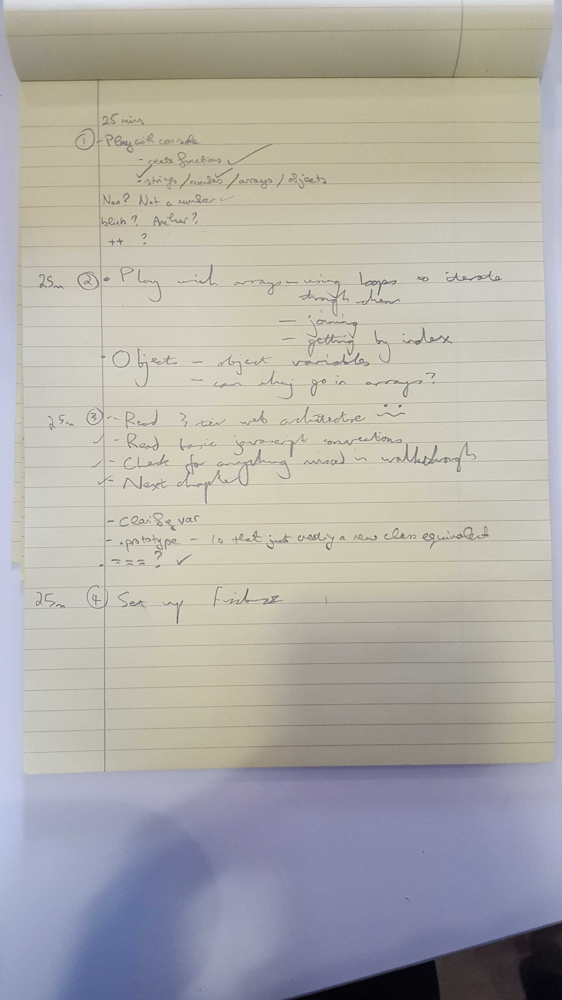

# FizzBuzz

To learn javascript we have re-written FizzBuzz.

To start, from root in terminal:
```
open Specrunner.html
```
Now in the page inspector console:

- To make a new fizzbuzz objects:
```
fizzbuzz = new Fizzbuzz();
```
- To play, pass a number to fizzbuzz's say function:
```
fizzbuzz.says(1);
```
- To see what fizzbuzz says about all the numbers 1 to 100:
```
for(var i = 0; i <= 100; i++){ console.log(fizzbuzz.says(i)) };
```

---


## Learning Javascript
---

JavaScript is a scripting language built for the web, and is the main language of the web as it is used by 75% of websites. This is because it is the only language that can be executed in the browser.
It doesn't have to make requests to a server the same way html does, which means it can be used for building interactivity within one page.

Use the Chrome console as a REPL
- Right click on web page > Inspect
- Click on console

```
console.log("Hello, world")
Hello, world
```

Understand JavaScript language conventions.
- The function keyword in JavaScript creates an object that can be invoked.
- If you want to return a value from a JavaScript function, you must explicitly use return, otherwise it will just return undefined.
- You must include the parentheses when invoking a function, even if there are no arguments.

Here we create a function that takes one parameter.

```
hi = function(name) {return 'Hi ' + name;}

hi('turtle')
"Hi turtle"
```
It is better to use var when declaring a variable because it scopes it to the closest gates.

Here we created an empty object and gave it a function we can invoke with one parameter.

```
greeting = {}
greeting.hello = function(name) { return name; }

greeting.hello('n00bs');
"n00bs"

greeting.hello = function(name) { return 'hello' + name; }

greeting.hello(' Nick');
"hello Nick"
```

- We know that joining two arrays together automatically becomes a string with no spaces.

```
mix = ['hat', 4, 7]
hat = 'hat'
array = [hat, hat, hat]

array + mix
"hat,hat,hathat,4,7"
```
Blank object can have their own variables.

```
door = {}
door.handle = 'metal'
door.handle
"metal"
door
{handle: "metal"}

```

Loops

Here we make a for loop that prints the numbers 1 to 10 in the browser console:

```
for (x = 0; x < 11; x++) {console.log(x)}
```

Prints the numbers 1 to 5:

```
var i = 0;
do {
  i += 1;
  console.log(i);
} while (i < 5);

```

Checks if two variables are the same:

```
1 === 1
true
```

## Our Approach
---
We broke the pairing session down into 25 minute sections, clarifying what we wanted to achieve in each block.


